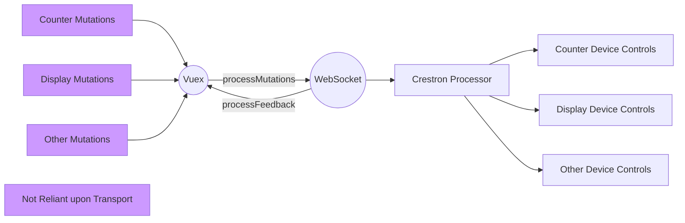

# crestron-vue-websocket-example

## Overview

This project, and it's sister project [crestron-vue-simpl-example](https://github.com/jeffderek/crestron-vue-simpl-example) are designed to demonstrate how to create a Vuex plugin for communication between a Crestron touchpanel and a Crestron processor without using CH5 elements.

These project are not intended to teach Vue or Vuex, nor are they intended to provide a ready-made framework for a full room system.

## Project Setup

1. UI
    1. Open the UI folder in Visual Studio Code
    2. In terminal, run `npm install`.
    3. Choose one of three ways to deploy the project
        1. Vue development server
            1. Either edit .env.development or create a new .env.development.local file. Change the value of `VUE_APP_LOCAL_PROCESSOR` to the hostname/ip of your local test processor. This is what the project will use to connect to your processor when using `npm run serve`
            2. Run the npm script `serve`. This will run the project on your local system
        2. Touchpanel
            1. Edit package.json to replace `test-tsw1070` in the `deploy` script with the hostname or address of your touchpanel
            2. Optionally follow the instructions [here](https://sdkcon78221.crestron.com/sdk/Crestron_HTML5UI/Content/Topics/UI-CH5-Archives.htm) to replace the `-p` flag in the `deploy` command with `-u` and `-i` after installing your SSH key on your touchpanel. This will prevent you from having to type your panel's username and password every time you deploy.
            3. Run the npm script `onestep:dev`. This will compile the project in development mode, package it as a .ch5z, transfer it to your touchpanel, and run the `projectload` command on the touchpanel to load the project.
            4. Point your touchpanel's IP Table at your control processor at IPID 0x03.
        3. Hosted on the processor as a webpage
            1. Run the npm script `build`.
            2. Transfer the contents of the `dist` folder into a subfolder of `html` on the processor. You must create a subfolder like `html\app`.
            3. Load [http://{{ipaddress}}/app/index.html](http://{{ipaddress}}/app/index.html) in your web browser.
2. Code
    1. Open the solution in your IDE of choice
    2. Build and load to your processor

## Project Structure

Both projects use the exact same Vue frontend. All state is stored in Vuex. Each project uses a custom plugin for Vuex that subscribes to mutations, sends data back to the Crestron processor, parses responses from the processor, and mutates the state in Vuex. Individual pages or classes within Vue have absolutely no direct relationship with the communication method to the processor.

The most important thing to understand about this process is that the only communication with the processor happens via the plugin. [`crestron.js`](https://github.com/jeffderek/crestron-vue-websocket-example/blob/main/UI/src/store/plugins/crestron.js) is the main file for the plugin. It exports a function that is run by default as soon as Vuex is loaded.

In this project, that function checks to see if the project is being run in one of three different modes.

1. Running on the programmer's PC on the Vue development server
2. Loaded to a touchpanel as a ch5z
3. Loaded to a Crestron processor as a webpage

Each mode gets the IP address of the processor in a different way. Once the project has determined the IP address of the processor, it opens a websocket connection to the processor. Once connected, it sets up the [`processMutations.js`](https://github.com/jeffderek/crestron-vue-websocket-example/blob/main/UI/src/store/plugins/crestron/processMutation.js) and [`processFeedback.js`](https://github.com/jeffderek/crestron-vue-websocket-example/blob/main/UI/src/store/plugins/crestron/processFeedback.js) functions. Those functions translate the Vuex mutations into whatever user-created API is to be used for communicating with the processor.

## UI Dependencies (and why they're included)

-   **Vue**
    -   Vue and it's associated dependencies, including Vuex and the Vue Router
    -   _vue_
    -   _vue-router_
    -   _vuex_
    -   _@vue/cli-plugin-router_
    -   _@vue/cli-plugin-vuex_
    -   _@vue/cli-service_
    -   _@vue/compiler-sfc_
-   **Sass**
    -   CSS Preprocessor
    -   _node-sass_
    -   _sass-loader_
-   **CrComLib**
    -   Crestron provided communication library that is used for system online/offline status and for getting the processor's IP address over serial join 1
    -   _@crestron/ch5-crcomlib_
-   **Reconnecting Websocket**
    -   Websocket implementation that automatically reconnects when the connection is lost
    -   _reconnecting-websocket_
-   **Eruda**
    -   On-screen console which lets you view the dev console directly on a touchscreen. Useful for debugging. Only initialized in development mode.
    -   _eruda_
-   **Lodash**
    -   Javascript utility library. Used in this project just for the debounce function which is used to debounce the system online/offline status.
    -   _lodash_

## Code Dependencies (and why they're included)

-   **Crestron.SimplSharp**
    -   Standard Crestron libraries
    -   _Crestron.SimplSharp.SDK.Library_
    -   _Crestron.SimplSharp.SDK.Program_
    -   _Crestron.SimplSharp.SDK.ProgramLibrary_
-   **Pellucid**
    -   Logging/Debugging library optimized for Crestron devices. Included to make debugging via SSH easier
    -   _Evands.Pellucid_
    -   _Evands.Pellucid.Pro_
-   **WebSocketSharp**
    -   C# Websocket server library, used to host the server that the Javascript websocket connects to
    -   _WebSocketSharp_
-   **StyleCop**
    -   Code Analysis tool that recommends and enforces adherence to coding styles.
    -   _StyleCop.Analyzers_

## Other Considerations

The translation between mutations and joins in this example uses an overly simplistic notation that would likely not scale very well. It is highly recommended that you develop a json schema that meets the requirements of your project. This demo program is focused on demonstrating one way in which the connection between the frontend and backend can be made.
